# TP 1
## Mini TP : Script de lecture de fichier

* TP1/script.js : Ce fichier lit le fichier data.csv et affiche son  contenu dans la console.

## Utilisation
  `node script.js FILE_NAME`

## Mini TP : appel du script de lecture via une API web

* TP1/server.js : Code du serveur Web
* TP1/template.pug : template de génération du code HTML
* TP1/style.css : feuille de style 

## Utilisation
  `node server.js FILE_NAME`

# TP 2
## Mini TP : Transformation du serveur avec Express

* TP2/expressServer.js : Ce fichier lit le fichier data.csv et affiche son contenu dans la console.
* TP2/views : Dossier contenant le template .pug et le style.css

## Utilisation
  `node expressServer.js FILE_NAME`

## Screenshot Postman 

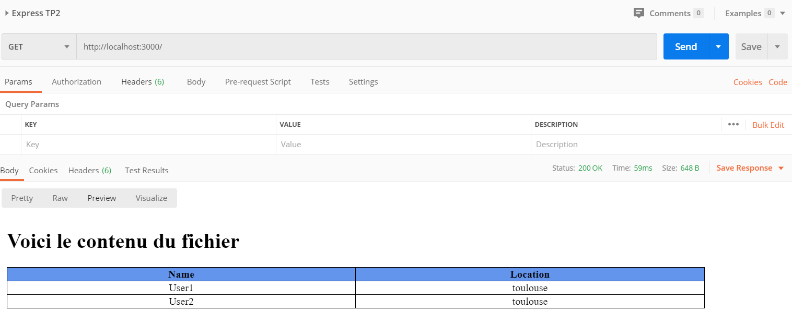 

# TP 3
## Mini TP : API d’écriture et de modification d’un fichier cities.json

* TP3/expressServer.js : Ce fichier lit le fichier cities.json et effectue les changements.
* TP3/public : Fichier cities.json

## Utilisation
  `node expressServer.js`

## Screenshot Postman 

### [GET] Retourne le contenu du fichier cities.json

 

### [GET] Le fichier cities.json n'existe pas 

 

### [POST] Ajout d'un ville dans le fichier cities.json

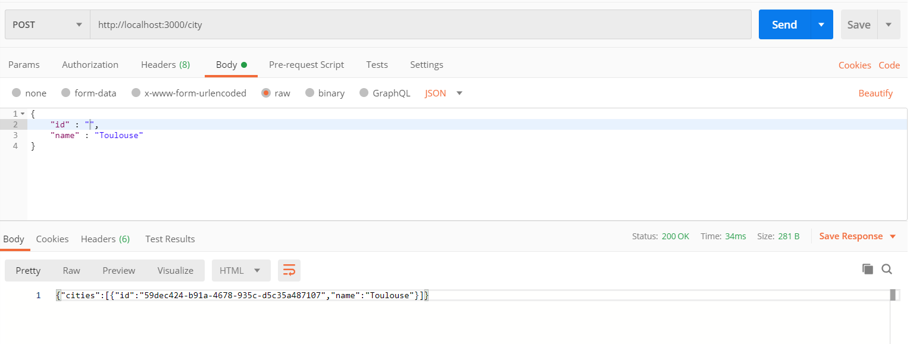 

### [POST] Ajout d'une seconde ville dans le fichier cities.json

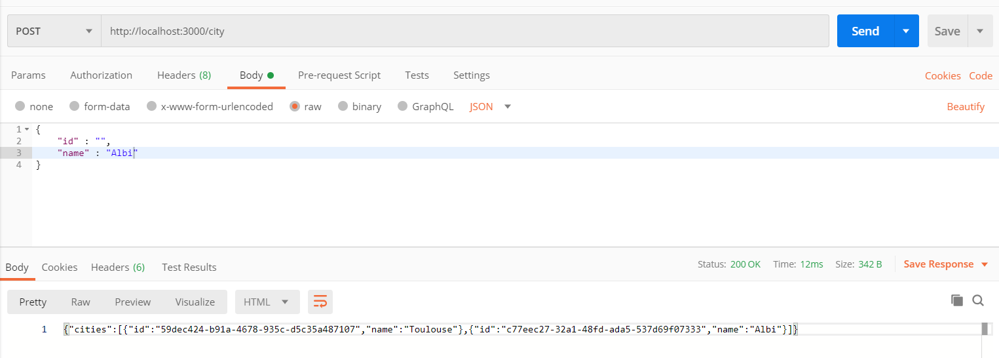 

### [POST] Une ville avec le même nom existe déjà dans le fichier cities.json

 

### [POST] Le body de la requête est vide

 

### [PUT] Modification du nom d'une ville dans le fichier cities.json

 

### [PUT] L'identifiant est introuvable ou une ville porte déjà le même nom dans le fichier cities.json

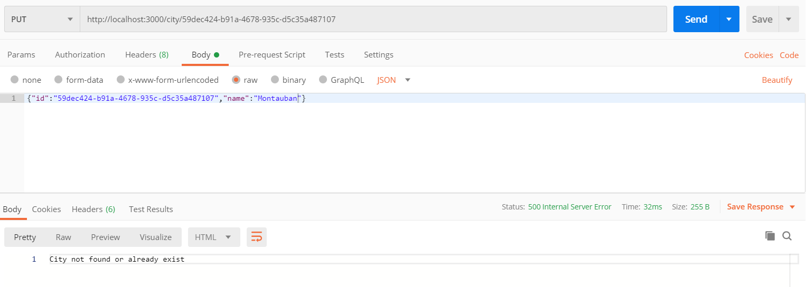 

### [DELETE] Suppression d'un ville dans le fichier cities.json

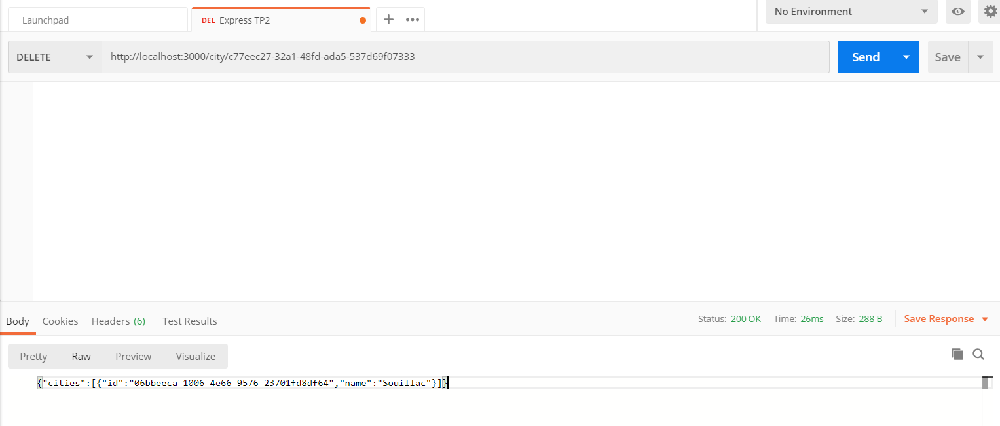 

### [DLETE] L'identifiant de la ville est introuvable dans le fichier cities.json

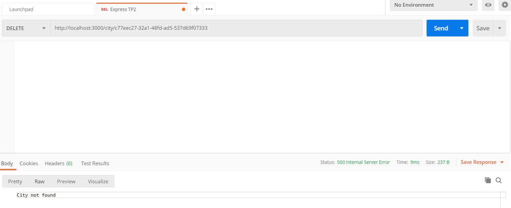 

# TP 4
## MongoDB : Transformer le serveur des TP précédents pour utiliser MongoDB et Mongoose

* TP4/mongoDb.js : Fichier du serveur.
* TP4/js : Fichiers js permettant de générer les appels à l'API.
* TP4/views : Fichier de template permettant de générer les fichiers HTML.

## Utilisation
  `node mongoDb.js

## Screenshot Postman

### [GET] Récupération de la liste des villes dans la base de données

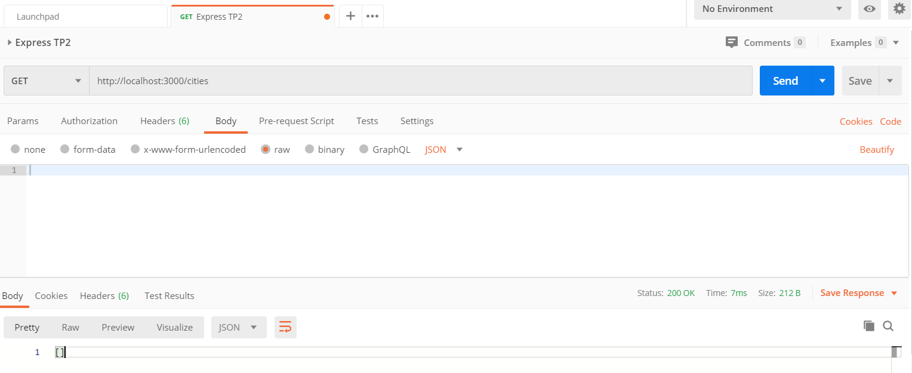 

### [POST] Ajout d'une ville dans la base de données

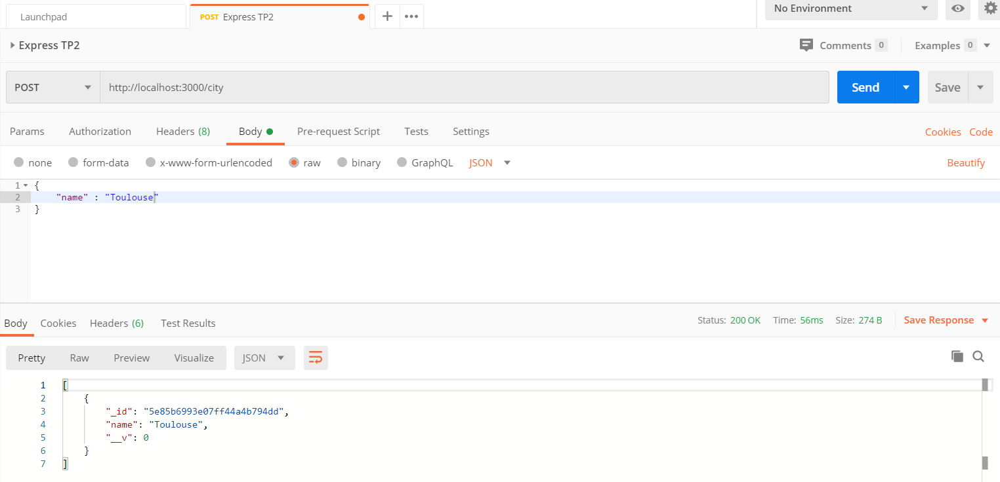 

### [POST] Une ville dans la base de données porte déjà la même nom

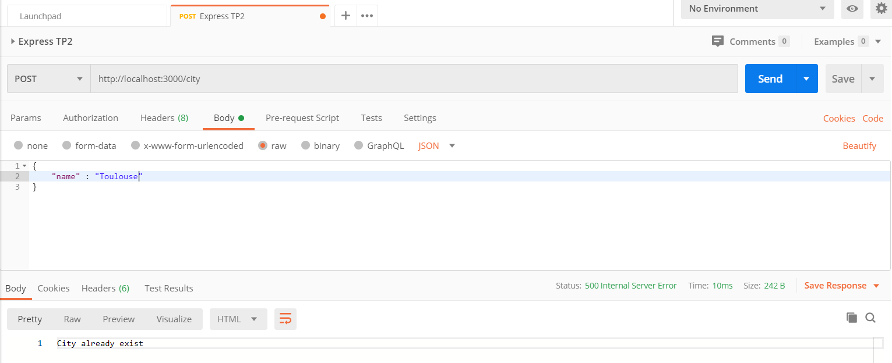

### [PUT] Modification du nom d'une ville dans la base de données

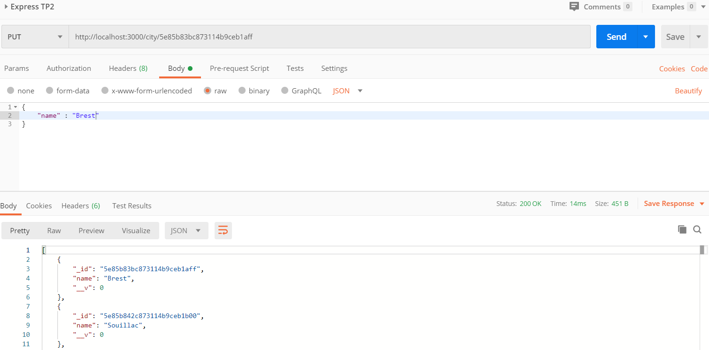

### [PUT] Une ville porte déjà le même nom

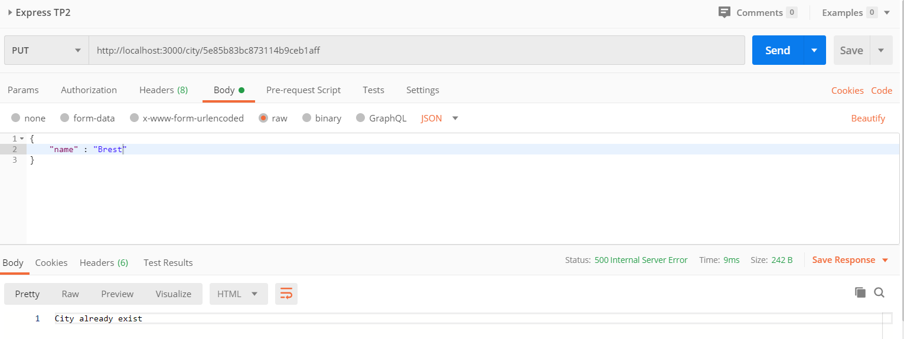

### [PUT] L'identifiant n'est pas trouvé dans la base de donnée

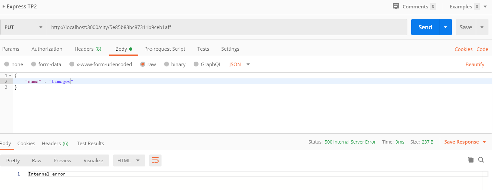

### [DELETE] Suppression de la ville dans la base de données

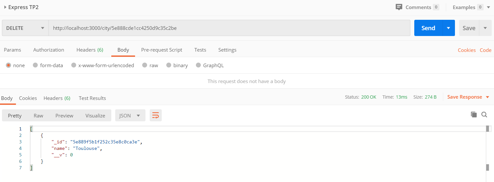

### [DELETE] Identifiant non trouvé dans la base de donnée

### [UI GET /] Interface permettant d'ajouter une ville 

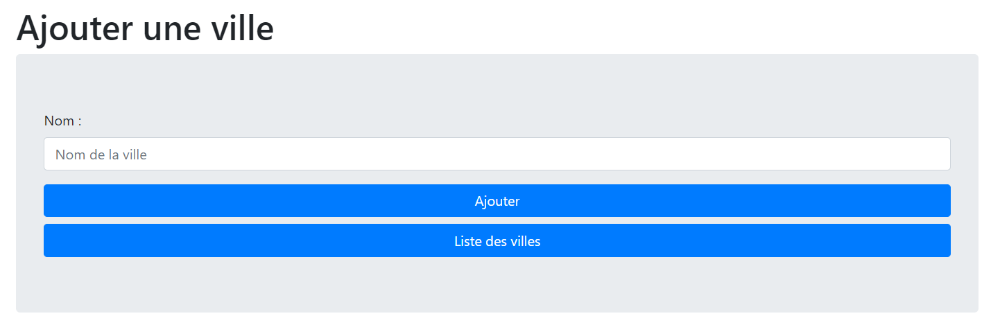

### [UI GET /city] Modification d'un ville via le bouton "Modifier". Redirection vers la liste des villes en cas de succès

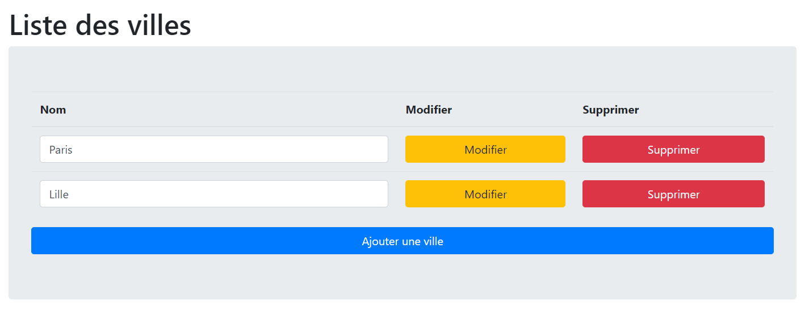

### [UI GET /city] Modification d'un ville via le bouton "Supprimer". Redirection vers la liste des villes en cas de succès

### [UI GET /city] Liste des villes dans la base de données

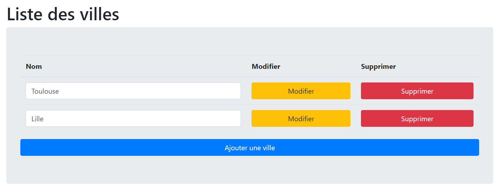
